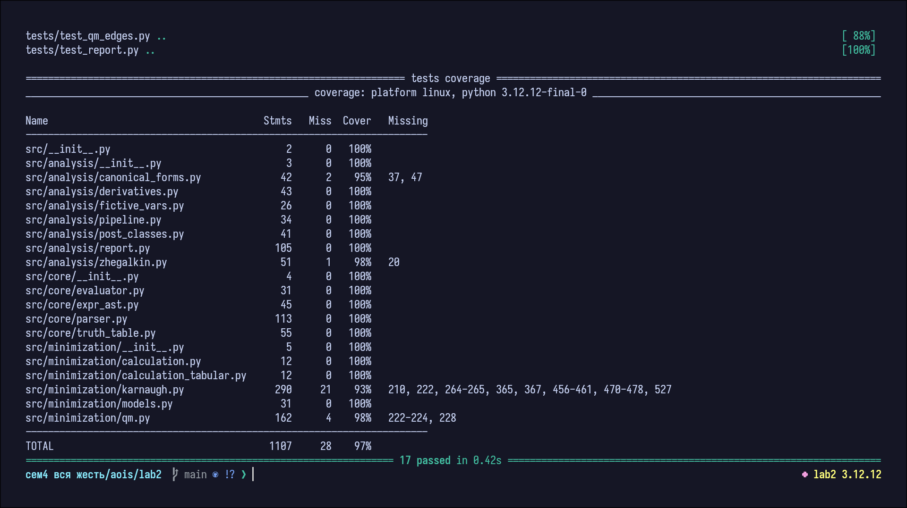

# Лабораторная работа №2

## Назначение
Проект предназначен для анализа булевых функций на основе таблиц истинности, построения канонических форм и выполнения минимизации несколькими методами.

## Реализованные возможности
- Разбор логических выражений с операциями `!`, `&`, `|`, `->`, `~`.
- Поддержка переменных `a..e` (до 5 переменных).
- Построение таблицы истинности и индексной формы.
- Построение СДНФ/СКНФ и числовых форм.
- Классификация по классам Поста (`T0`, `T1`, `S`, `M`, `L`).
- Построение полинома Жегалкина.
- Поиск фиктивных и существенных переменных.
- Булевы производные (частные и смешанные, порядок `1..4`).
- Минимизация функции:
  - расчетный метод;
  - расчетно-табличный метод;
  - табличный метод (карта Карно для `1..5` переменных).

## Структура проекта
- `main.py` — CLI-вход.
- `src/core/` — AST, парсер, вычисление выражений, таблица истинности.
- `src/analysis/` — аналитические модули и формирование отчета.
- `src/minimization/` — алгоритмы минимизации и вспомогательные модели.
- `tests/` — набор автоматических тестов.

## Запуск
Из каталога `lab2`:

```bash
python main.py
```

или с выражением:

```bash
python main.py "!(a & b) -> (c ~ d)"
```

## Запуск тестов
Из каталога `lab2`:

```bash
pytest -q
```

Проверка покрытия:

```bash
pytest -q --cov=src --cov-report=term-missing
```

## Результаты тестирования



## Примечания
- Выбор покрытия в `src/minimization/qm.py` реализован жадной стратегией.
